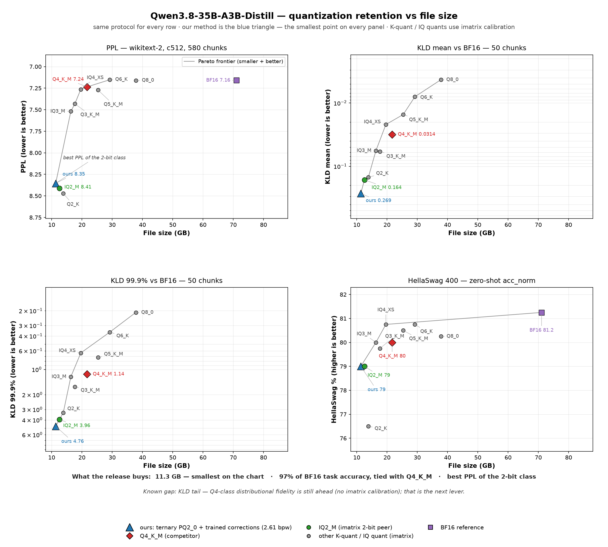

# Scion: ternary MoE quantization with trained corrections

Scion is the project behind [**Scion-35B-A3B**](https://huggingface.co/SkyIsNotGreen/Scion-35B-A3B),
split out of [bonsai2-ternary-forensics](https://github.com/sky-is-green/bonsai2-ternary-forensics)
so the harness, the port decisions and the release docs can be cloned and run on
their own. The dense-model forensics (Bonsai 2 27B) stayed in that repository.

**The idea.** Ternarise the expert banks of a pretrained MoE in place, then
recover the routing damage with small trained corrections on the residual
stream. No full-precision masters and no full-model QAT. The frozen body ships
at 2.125 bpw (`Q1_0_g128` / `PQ2_0` ternary experts, Q8_0 for the rest); the
corrections are rank-512 branches on the attention output and the MoE block
output, plus router deltas, trained by output-KD **with the deployed quantizer
in the loop**.

## Reference release: Scion-35B-A3B

`empero-ai/Qwen3.8-35B-A3B-Distill` (a Qwen3.8-line distill on
`Qwen/Qwen3.6-35B-A3B`), ternary experts, Q8_0 rest and embedded corrections:
**11.34 GB / 2.61 bpw** in one file, no `--lora` step.

| metric | **Scion-35B-A3B** | Q4_K_M | BF16 |
|---|---|---|---|
| PPL, wikitext-2, c512, 580 chunks | **8.354** | 7.235 | 7.160 |
| KLD mean vs BF16, 50 chunks | 0.269 | 0.031 | — |
| HellaSwag 400 | 79.00 | 80.00 | 81.25 |
| Winogrande 400 | **76.25** | 76.00 | 76.00 |

Task accuracy is inside the ±2% noise band, PPL is the best of the 2-bit class,
and the KLD tail is the known gap and the current work item
(`docs/TAIL-EXPERIMENT-PLAN.md`). The full table against every community quant
of the same model is in `docs/QUANT-RETENTION-35B.md`.



The grid shows file size (left is smaller) against quality, with the PPL and KLD
axes inverted so the better end is up. Every row uses the same protocol.

Card and weights:
[`SkyIsNotGreen/Scion-35B-A3B`](https://huggingface.co/SkyIsNotGreen/Scion-35B-A3B).
A snapshot of the card is kept at `docs/RELEASE-35B-MODEL-CARD.md`.

## What the experiments established

- routing drift compounds and is the dominant failure mode (`docs/MOE-EXTENSION.md` §2.1);
- rotation is not the missing lever for MoE (§2.2);
- in-place ternary QAT on its own does not recover it at local budgets (§2.3);
- corrections must live on the **residual stream**, not inside experts; that is the placement rule (§2.4);
- router-KD is a verified no-op, and the correction repairs the state the router reads instead (§2.4a);
- train the sidecar in the deployed format, because post-hoc ternarisation is 14 to 25 times worse (§2.4c);
- the deployable Lloyd quantizer beats one-shot absmean (§2.4d);
- `attn_out` ships as a standard llama.cpp LoRA, and the better `moe_out` placement needs the ~90-line fork extension (§2.4e).

An earlier proof on the frozen proxy `allenai/OLMoE-1B-7B-0924`: the uncorrected
mixed GGUF measured **566.7 PPL, and 14.48** with both placements and routers
(2.12 GB body, 22.2 MB adapter), with CPU and HIP builds agreeing.

## Quickstart

**Local and free: the OLMoE proxy.** Python 3.10 or newer, torch (ROCm or CUDA
wheels), `transformers`, `datasets`, `numpy` and `pyyaml`. The run sequence is in
[`moe/README.md`](moe/README.md). The in-place ternary QAT negative control is
`moe/olmoe_proxy.py` and the correction trainer is `moe/olmoe_corrections.py`.

**Rental: the 35B path, one 80 GB card, about $7.** Quantize the deployment body
locally first (`llama-quantize` with the experts mapped to `pq2_0` and
`GGML_PQ2_0_LLOYD=1`), run the box stages, then merge the exported adapter into
the body with `moe/merge_adapter_into_body.py`:

```bash
bash moe/box-run.sh setup && bash moe/box-run.sh smoke && bash moe/box-run.sh cache
bash moe/box-run.sh ref   && bash moe/box-run.sh train && bash moe/box-run.sh eval && bash moe/box-run.sh export
```

Every stage is resumable, and checkpoints and the teacher cache land on the
volume. Port notes: `moe/PORT-QWEN35.md`; the architecture decision record:
`docs/QWEN35-PORT-DECISION.md`.

**Runtime.** Ternary experts and embedded adapters live in
[`sky-is-green/prism-ml-llama.cpp`](https://github.com/sky-is-green/prism-ml-llama.cpp),
branch `moe-corr-runtime` (PQ2_0 container, `ffn_moe_out` virtual target,
embedded adapters; about 90 lines on top of Prism ML's `prism` branch).

## Layout

| path | what |
|---|---|
| `moe/` | the harness: proxies, correction trainers, port, rental runbook, export and bench tooling, result JSONs |
| `docs/` | write-ups: the MoE extension, release table, port decision, tail plan, registers |
| `serving/` | serving experiments: placement sweep (ternary vs f16 offload, threads, split modes) and the expert-cache handoff |
| `scion_moe/` | vendored `rotation` and RTN quantizer used by the harness |
| `retention-grid.png` | the release figure (regenerate with `moe/plot_bench.py`, which writes into `moe/results/qwen35-retention/`) |

## Serving notes (measured on two RX 7900 XT cards and a 7800X3D)

- the ternary container roughly **halves the CPU-expert-offload penalty** compared to f16 (2.07 GiB OLMoE: 34% and 50% versus 86% and 75% for prefill and decode);
- **threads should equal physical cores** (`-t 16` collapses generation from 95 to 35 t/s on an 8C/16T CPU);
- do not layer-split when one card fits (40% generation loss);
- `-ncmoe` is the VRAM-budget dial, and placement does not change the math;
- a hot-expert GPU cache gave **no throughput gain**, because `mul_mat_id` computes k experts per token regardless of the weights. It would need sparse per-token dispatch rather than a static split (`serving/placement-sweep-20260927/THROUGHPUT.md`).

## Provenance

Split from
[`sky-is-green/bonsai2-ternary-forensics`](https://github.com/sky-is-green/bonsai2-ternary-forensics)
at `b01f7e2` (2026-09-27). The dense forensics, the replication ladder and their
failure register stayed there; this track's register is [`FAILURES.md`](FAILURES.md).

## License and attribution

Apache-2.0; see [`LICENSE`](LICENSE) and [`NOTICE`](NOTICE). Base model:
**empero-ai** (Apache-2.0) and **Qwen / Alibaba Cloud** (Apache-2.0); container
and kernels: **Prism ML**'s llama.cpp fork (MIT) with **TAARDIS** conventions
(MIT); engine: **llama.cpp** (MIT). Not affiliated with, endorsed by, or
supported by Prism ML, empero-ai, or Alibaba Cloud.
